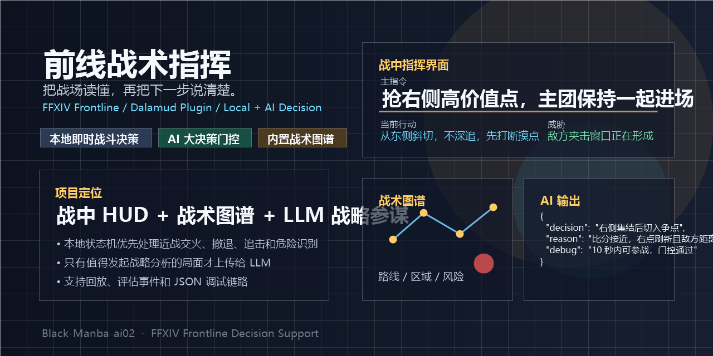

# 前线战术指挥

<p align="center">
  
</p>

<p align="center">
  把战场读懂，再把下一步说清楚。
</p>

<p align="center">
  <a href="https://github.com/FF14Yoshiko/Black-Manba-ai02/actions/workflows/build.yml"></a>
  <a href="https://github.com/FF14Yoshiko/Black-Manba-ai02/blob/main/LICENSE"></a>
  
  
  
</p>

`ai02` 是一个面向《最终幻想 XIV》纷争前线的 Dalamud 插件，围绕实战中的三个关键问题展开：

- 现在战场发生了什么
- 下一步应该去哪里、打谁、为什么
- 哪些决策必须本地即时完成，哪些局势值得交给 AI 做大决策

它不是一个只会堆信息的 HUD，而是一套把战场采集、本地战术状态机、地图战术图谱、AI 门控和回放调试串起来的前线指挥工具。

## 核心特性

- **战中极简指挥 HUD**  
  以主指令、当前行动、威胁为核心输出，压缩成实战能快速扫读的短句。

- **本地即时战斗决策**  
  近战交火、撤退、追击、危险识别等高时效逻辑优先走本地状态机，不依赖 LLM 响应。

- **AI 大决策门控**  
  只在值得发起战略分析的局面请求 LLM，例如抢点博弈、第三方夹击、比分临界期和远点抉择。

- **内置地图战术图谱**  
  支持战术点位、区域、路线和风险建模，并可在运行中做动态路径分析。

- **回放与调试链路**  
  记录战场帧、评估事件和决策反馈，用于复盘、调权重和观察 AI JSON 稳定性。

- **LLM 接入可控**  
  当前默认接入 `deepseek-v4-flash`，支持上下文连续对局、手动强制请求和调试 payload 输出。

## 适合什么场景

- 想把前线 HUD 从“看很多信息”变成“看对的信息”
- 想验证 AI 在三方大规模 PvP 中的延迟、稳定性和指挥质量
- 想把地图知识、指挥经验和门控规则沉淀成能反复调的系统
- 想持续迭代一套“本地即时 + AI 战略”的混合决策框架

## 设计取向

这个项目有几个很明确的工程约束：

1. **即时战斗不能等 AI**
2. **AI 只参与大决策，不接管整局细节执行**
3. **能本地低风险解决的局面，优先本地解决**
4. **UI 文案要短、快、能落到实战行为**
5. **地图知识和战场规则要能进入决策，而不只是展示**

如果你对“战中实时系统”和“延迟容忍的 AI 决策协作”感兴趣，这个仓库会比较有意思。

## 模块一览

- `src/Core/Plugin.cs`  
  插件入口与服务装配

- `src/Decision/WorldStateService.cs`  
  战场采集、主循环、快照整合和节流调度

- `src/Decision/TacticalDecisionEngineService.cs`  
  本地即时指挥与战术评分

- `src/Decision/LlmStrategicDecisionService.cs`  
  AI 大决策门控、请求、JSON 解析和会话上下文

- `src/Map/MapTacticalGraphService.cs`  
  内置/自定义战术图谱加载、版本管理和图谱合成

- `src/Map/MapTacticalAnalysisService.cs`  
  图谱、动态目标与局势结合后的路径/区域分析

- `src/Decision/BattlefieldReplayRecorder.cs`  
  回放记录、评估事件和调权反馈

## 仓库结构

```text
.
├─ .github/workflows/          GitHub Actions 构建流程
├─ BuiltInTacticalGraphs/      内置战术图谱 JSON
├─ docs/                       仓库展示与补充文档
├─ images/                     README 与插件资源
├─ scripts/                    打包校验脚本
├─ src/
│  ├─ Core/                    插件入口与配置
│  ├─ UI/                      主窗口、雷达、HUD、界面服务
│  ├─ Frontline/               前线比分、公告、聊天、知识库
│  ├─ Decision/                主状态机、LLM 决策、回放
│  ├─ Map/                     战术图谱、标注、区域分析
│  ├─ Combat/                  战斗事件、状态、标记、Hook
│  └─ Models/                  战场快照与共享模型
└─ ai02.csproj
```

## 本地构建

本项目基于 `.NET 10`，依赖 Dalamud 开发环境。

1. 准备 Dalamud 开发库

```text
%AppData%\XIVLauncherCN\addon\Hooks\dev\
```

2. 构建

```powershell
dotnet build ai02.csproj -c Release
```

3. Release 打包产物

```text
bin/Release/ai02/latest.zip
```

## LLM 配置

- 默认 Provider：`https://api.deepseek.com`
- 默认模型：`deepseek-v4-flash`
- API Key 不应提交到仓库
- 建议把密钥保存在插件配置或环境变量中

## CI

仓库已包含 GitHub Actions 构建流程：

- `push`
- `pull_request`
- `workflow_dispatch`

CI 会自动恢复 Dalamud 开发依赖、构建 Release 包，并校验 `latest.zip`。

## 下载

- 想直接下载成品，请看 GitHub 的 **Releases**
- Release 资产会包含：
  - `latest.zip`
  - `latest.zip.sha256`

发布方式也已经配好：

- 推送标签（例如 `v1.1.1`）后，GitHub Actions 会自动构建并创建 Release
- 也可以在 Actions 页手动运行 `Release Plugin` 工作流，指定标签名后发布

## Roadmap

- 把更多 `FrontlineKnowledgeBase` 规则转成可量化 bias
- 继续补全 Secure / Shatter / Onsal / Vochester 的地图与收益模型
- 继续打磨 AI 门控阈值与人工强制请求体验
- 完善回放驱动的指挥质量反馈
- 补充更完整的实战截图和说明文档

## 仓库设置建议

如果你准备把这个项目作为 GitHub 开源仓库长期维护，建议在仓库 About 中使用：

- **Description**  
  `FFXIV 纷争前线 Dalamud 插件，提供战场态势感知、本地即时战术决策、LLM 大决策、战术图谱与回放调试。`

- **Topics**  
  `ffxiv`, `dalamud`, `dalamud-plugin`, `xivlauncher`, `pvp`, `frontline`, `radar`, `tactical-decision`, `battlefield-analysis`, `deepseek`, `replay-analysis`, `plugin`

- **Social Preview / Cover**  
  使用仓库内的 `docs/assets/github-cover.png`

## 免责声明

本项目仅代表个人研究与工程实践整理，不隶属于 SQUARE ENIX，也不代表任何官方立场。请自行判断使用风险，并遵守对应平台与社区规则。

## License

[MIT](./LICENSE)
